# Template Claude Code para Spring Boot

> **Fonte original:** [Claude Code Template for Spring Boot – Piotr's TechBlog](https://piotrminkowski.com/2026/03/24/claude-code-template-for-spring-boot/)  
> **Autor:** Piotr Minkowski | **Publicado em:** 24 de março de 2026

---

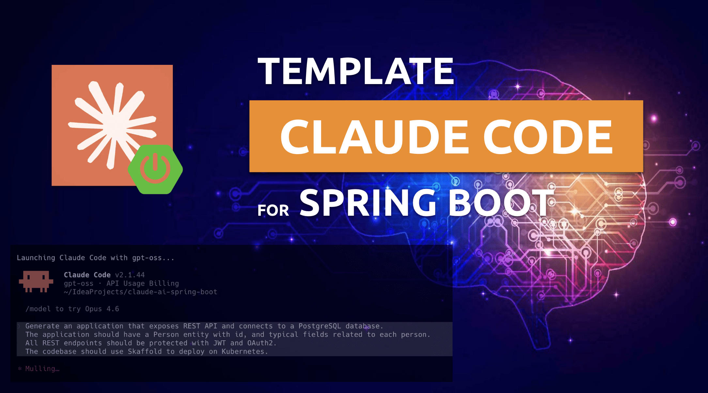

A alguns dias, publiquei minha proposta de template do Claude Code para uma aplicação Spring Boot típica neste [repositório do GitHub](https://github.com/piomin/claude-ai-spring-boot). O nível de interesse nesse repositório superou minhas maiores expectativas. Recebi muito feedback de vocês, mas estou ansioso por mais. Claro, o projeto ainda está em desenvolvimento. Portanto, se você quiser dar feedback ou tiver ideias para melhorá-lo, encorajo você a criar issues, pull requests, ou visitar o painel *"Discussions"*, que habilitei para este repositório.

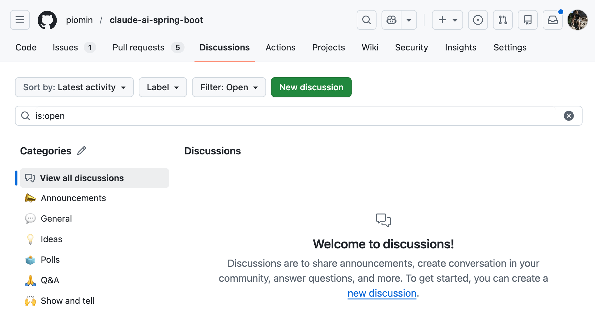

Se você tem interesse em aplicações Java e Spring Boot, especialmente em ambiente Kubernetes, pode ler mais sobre o assunto no meu livro mais recente, [**Hands-On Java with Kubernetes**](https://leanpub.com/hands-on-java-with-kubernetes).

No meu blog, você encontrará vários outros artigos sobre o Claude Code. Por exemplo, [este artigo](https://piotrminkowski.com/2026/02/17/create-apps-with-claude-code-on-ollama/) explica como executar o Claude Code no Ollama e usar modelos locais ou em nuvem servidos pelo Ollama para criar aplicações Java.

---

## Motivação

Antes de entrarmos nos detalhes, deixe-me explicar por que criei este template. Na documentação do Claude Code, você encontrará diversas boas práticas para usá-lo na geração de código. Claro, você pode simplesmente iniciar o Claude Code e digitar qualquer prompt que vai gerar algo. No entanto, se você quiser que o código gerado atenda às suas expectativas, vale a pena seguir essas boas práticas.

A maioria de vocês, portanto, ao iniciar a jornada com o Claude Code, vai cedo ou tarde buscar um template de repositório pronto que corresponda ao tipo de aplicação que deseja gerar. Por outro lado, criar esse template por conta própria pode levar muito tempo e exigir muita tentativa e erro. Comunidades focadas em uma tecnologia específica deveriam manter, melhorar e compartilhar seus templates. Isso beneficia a todos os envolvidos.

Então, onde é o melhor lugar para encontrar inspiração para esses tipos de templates em várias tecnologias? Provavelmente entre pessoas que postam muito online sobre um determinado assunto. E como posto bastante sobre Spring Boot e Java, sinto que é meu dever manter e desenvolver esse template. Você pode usar este repositório como inspiração para criar o seu próprio, ou como um repositório inicial pronto para uso que requer apenas mudanças mínimas no arquivo `CLAUDE.md`.

---

## Código-fonte

Sinta-se à vontade para usar meu código-fonte se quiser experimentar. Para isso, você deve clonar meu [repositório de exemplo no GitHub](https://github.com/piomin/claude-ai-spring-boot.git). Em seguida, basta seguir minhas instruções. Abaixo está a estrutura atual do repositório. Mas, claro, o projeto ainda está em desenvolvimento e pode sofrer mais mudanças.

```
.
├── .claude
│   ├── agents
│   │   ├── code-reviewer.md
│   │   ├── devops-engineer.md
│   │   ├── docker-expert.md
│   │   ├── java-architect.md
│   │   ├── kubernetes-specialist.md
│   │   ├── security-engineer.md
│   │   ├── spring-boot-engineer.md
│   │   └── test-automator.md
│   ├── settings.local.json
│   └── skills
│       ├── README.md
│       ├── api-contract-review
│       │   └── SKILL.md
│       ├── clean-code
│       │   └── SKILL.md
│       ├── design-patterns
│       │   └── SKILL.md
│       ├── java-architect
│       │   ├── SKILL.md
│       │   └── references
│       │       ├── jpa-optimization.md
│       │       ├── reactive-webflux.md
│       │       ├── spring-boot-setup.md
│       │       ├── spring-security.md
│       │       └── testing-patterns.md
│       ├── java-code-review
│       │   └── SKILL.md
│       ├── jpa-patterns
│       │   └── SKILL.md
│       ├── logging-patterns
│       │   └── SKILL.md
│       ├── spring-boot-engineer
│       │   ├── SKILL.md
│       │   └── references
│       │       ├── cloud.md
│       │       ├── data.md
│       │       ├── security.md
│       │       ├── testing.md
│       │       └── web.md
│       └── spring-boot-patterns
│           └── SKILL.md
├── CLAUDE.md
├── README.md
└── pom.xml
```

---

## Recomendações do Claude

### Geral

O Claude funciona de forma muito mais eficaz quando tem um meio de verificar seus próprios resultados — seja executando testes, comparando capturas de tela ou validando saídas em relação às expectativas. Sem critérios de sucesso claramente definidos, ele pode gerar soluções que parecem corretas na superfície, mas falham na prática. Nesses casos, você se torna a única fonte de feedback, o que significa que cada falha depende da sua revisão e correção.

O fluxo de trabalho recomendado pela Anthropic deve ter quatro fases:

1. **Explorar**
2. **Planejar**
3. **Implementar**
4. **Commitar**

Não quero listar aqui todas as boas práticas descritas pela Anthropic. Dê uma olhada nesta [página](https://code.claude.com/docs/en/best-practices). Basicamente, o principal arquivo que precisamos criar no nosso repositório é o `CLAUDE.md`. Admito que, em relação à sua estrutura, me inspirei bastante no trabalho da equipe da Anthropic, que publicou informações online sobre o conteúdo de seus arquivos `CLAUDE.md`. O `CLAUDE.md` funciona como um briefing embutido que o Claude carrega no início de cada interação. É o lugar para definir coisas como comandos Bash comuns, convenções de código e fluxos de trabalho da equipe. Ao colocar essas informações em um único arquivo, você fornece ao Claude contexto e orientação consistentes que ele não conseguiria deduzir de forma confiável apenas analisando seu código-base.

### CLAUDE.md no repositório

Veja meu arquivo `CLAUDE.md`. Ele contém várias instruções gerais para um design universal, bem como alguns elementos específicos para minha aplicação. Foi importante para mim habilitar o modo de planejamento, para que eu pudesse ver exatamente o que seria gerado antes que o Claude Code começasse a trabalhar.

Outro passo fundamental é verificar o código gerado criando testes automatizados e executando-os. Também quero que o código gerado seja o mais simples possível, por isso peço ao Claude que o revise em busca de overengineering. Os pontos 5 e 6 cobrem como carregar e usar skills e subagentes. As skills são absolutamente essenciais — chegaremos nelas em breve. Por outro lado, os subagentes podem aumentar significativamente o número de tokens utilizados, então vale a pena considerar cuidadosamente seu uso.

```markdown
### 1. Modo de Planejamento Padrão
- Entre no modo de planejamento para QUALQUER tarefa não trivial (3+ etapas ou decisões arquiteturais)
- Use o modo de planejamento também para etapas de verificação, não apenas para construção
- Escreva especificações detalhadas antecipadamente para reduzir ambiguidades

### 2. Loop de Automelhoria
- Após QUALQUER correção do usuário: atualize `tasks/lessons.md` com o padrão
- Escreva regras para você mesmo que previnam o mesmo erro
- Itere incansavelmente nessas lições até que a taxa de erros caia
- Revise as lições no início da sessão de um projeto

### 3. Verificação Antes de Concluir
- Nunca marque uma tarefa como concluída sem provar que funciona
- Diferencie o comportamento entre o main e suas alterações quando relevante
- Pergunte a si mesmo: "Um engenheiro sênior aprovaria isso?"
- Execute testes, verifique logs, demonstre a correção

### 4. Exija Elegância (de forma equilibrada)
- Para mudanças não triviais: pause e pergunte "existe uma forma mais elegante?"
- Se uma correção parece gambiarrada: "Sabendo tudo o que sei agora, implemente a solução elegante"
- Pule isso para correções simples e óbvias. Não superengenharie
- Questione seu próprio trabalho antes de apresentá-lo

### 5. Uso de Skills
- Use skills para qualquer tarefa que exija uma capacidade
- Carregue skills de `.claude/skills/`
- Invoque skills com linguagem natural
- Cada skill é uma capacidade independente

### 6. Uso de Subagentes
- Use subagentes liberalmente para manter a janela de contexto principal limpa
- Carregue subagentes de `.claude/agents/`
- Para problemas complexos, aplique mais poder computacional via subagentes
- Uma tarefa por subagente para execução focada em uma determinada stack tecnológica

## Princípios Fundamentais
- **Simplicidade Primeiro**: Torne cada mudança o mais simples possível. Impacte o mínimo de código
- **Sem Preguiça**: Encontre as causas raiz. Sem correções temporárias. Padrões de desenvolvedor sênior

## Instruções Gerais do Projeto

- Sempre use as versões mais recentes das dependências.
- Sempre escreva código Java como aplicação Spring Boot.
- Sempre use Maven para gerenciamento de dependências.
- Sempre crie casos de teste para o código gerado, tanto positivos quanto negativos.
- Sempre gere o pipeline do CircleCI no diretório .circleci para verificar o código.
- Minimize a quantidade de código gerada.
- O nome do artefato Maven deve ser o mesmo que o nome do diretório pai.
- Use versionamento semântico para o projeto Maven. Cada vez que gerar uma nova versão, incremente a seção PATCH do número de versão.
- Use `pl.piomin.services` como group ID para o projeto Maven e pacote Java base.
- Não use a biblioteca Lombok.
- Gere o arquivo Docker Compose para rodar todos os componentes usados pela aplicação.
- Atualize o README.md cada vez que gerar uma nova versão.
```

Tudo listado na seção *"Instruções Gerais do Projeto"* representa minhas principais expectativas para o código gerado. Mesmo que alguns desses pontos já sejam abordados em uma das skills, eles são importantes o suficiente para que eu queira enfatizá-los novamente. Da sua perspectiva, esses podem ser tecnologias específicas, como o CircleCI, que você pode simplesmente ignorar removendo a linha relevante do `CLAUDE.md`.

Se você não quiser usar subagentes, pode reescrever a Seção 6 do `CLAUDE.md` da seguinte forma. Isso força o Claude Code a usar o agente `spring-boot-engineer`, especializado em gerar código para aplicações Spring Boot.

```markdown
### 6. Uso de Subagentes
- Carregue subagentes de `.claude/agents/`
- Não use subagentes
- Use apenas o agente personalizado único `spring-boot-engineer` como agente principal
```

Você pode verificar a lista de agentes disponíveis executando o comando `/agents`.

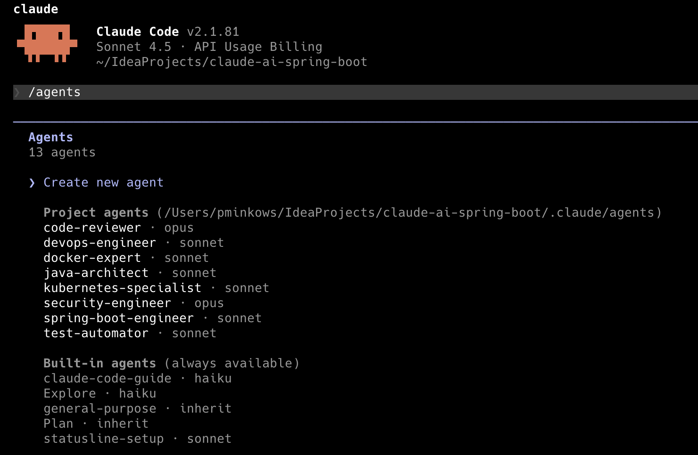

### Skills

Antes de digitar seu prompt e gerar o código, você pode verificar a lista de skills carregadas usando o comando `/skills`. Como você pode ver, defini nove skills no diretório `.claude/skills`.

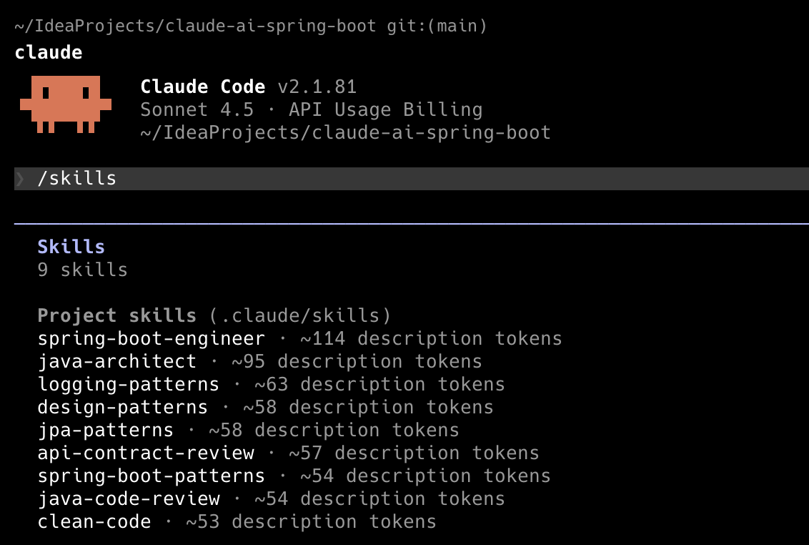

As skills visam ampliar o conhecimento do Claude com informações específicas das tecnologias usadas por uma determinada aplicação. Cada skill deve ter uma seção de cabeçalho dentro dos marcadores `---`. Ela deve ter as tags `name` e `description`. Também podemos adicionar alguns rótulos adicionais dentro da tag `metadata`. As skills no meu repositório estão relacionadas principalmente às boas práticas de codificação em Spring, Java e JPA (Hibernate). Aqui está um fragmento de uma skill do meu repositório:

```yaml
---
name: java-architect
description: Use quando construir, configurar ou depurar aplicações Java empresariais com Spring Boot, microsserviços ou programação reativa. Invoque para implementar endpoints WebFlux, otimizar consultas JPA e desempenho de banco de dados, configurar Spring Security com OAuth2/JWT, ou resolver problemas de autenticação e processamento assíncrono em aplicações Spring nativas de nuvem.
metadata:
  version: "1.0.0"
  domain: language
  triggers: Spring Boot, Java, microservices, Spring Cloud, JPA, Hibernate, WebFlux, reactive, Java Enterprise
  role: architect
  scope: implementation
  output-format: code
---

# Java Architect

Especialista em Java empresarial com foco em Spring Boot, arquitetura de microsserviços e desenvolvimento nativo de nuvem usando Java 21 LTS.

## Fluxo de Trabalho Principal

1. **Análise de arquitetura** - Revisar estrutura do projeto, dependências, configuração do Spring
2. **Design de domínio** - Criar modelos seguindo DDD e Clean Architecture; verificar limites de domínio antes de prosseguir.
3. **Implementação** - Construir serviços com as melhores práticas do Spring Boot
4. **Camada de dados** - Otimizar consultas JPA, implementar repositórios; executar `mvn verify -pl <module>` para confirmar a correção das queries.
5. **Segurança e configuração** - Aplicar Spring Security, externalizar configuração, adicionar observabilidade
6. **Garantia de qualidade** - Executar `mvn verify` para confirmar que todos os testes passam e a cobertura atinge 85%+.
```

---

## Usando o Claude Code para Spring Boot

### Prompt de entrada

É hora de testar nosso template. Após clonar o repositório, navegue até o diretório raiz e execute o Claude Code. Abaixo está o prompt que usei para gerar uma aplicação de exemplo para este exercício. Ele descreve brevemente o que a aplicação deve fazer e quais tecnologias usar. Claro, esse prompt deve ser visto como parte de um todo mais amplo, juntamente com todos os componentes que apresentei até agora.

```
Crie a aplicação que expõe uma API REST e se conecta a um banco de dados PostgreSQL no diretório atual.
A aplicação deve ter uma entidade Person com um id e campos típicos para cada pessoa.
Todos os endpoints REST devem ser protegidos com JWT e OAuth2.
O código deve usar Skaffold para implantação no Kubernetes.
```

Imediatamente após iniciar o Claude Code, insira o prompt descrito acima ou o seu próprio prompt, como preferir. Como você pode ver, o Claude Code começa criando um plano e desenvolvendo uma estratégia de implementação.

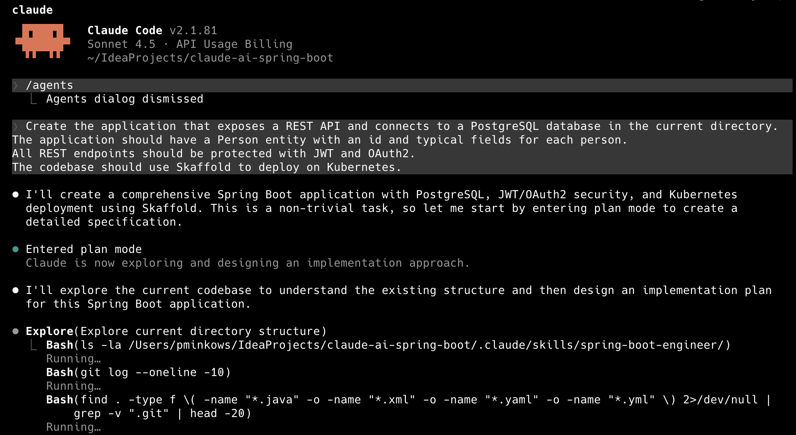

Abaixo está o plano de trabalho gerado. O Claude Code também fornecerá uma estimativa do número de tokens necessários para gerar nossa aplicação com base nos requisitos especificados.

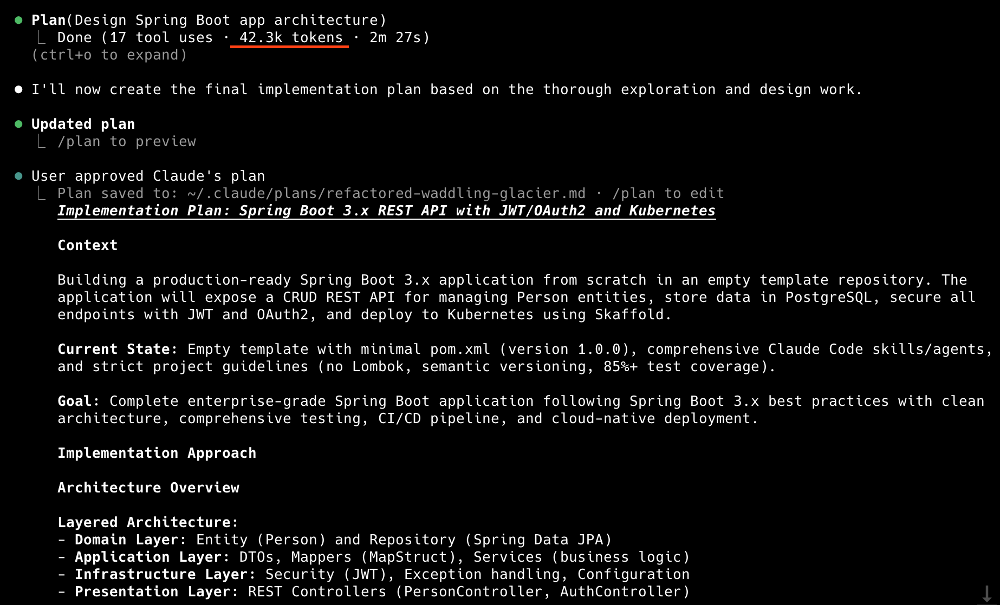

O plano é muito detalhado. Para resumir, aqui está uma lista das principais tecnologias e decisões arquiteturais, juntamente com os critérios de sucesso. Tudo que resta é aprovar o plano e prosseguir para a geração do código.

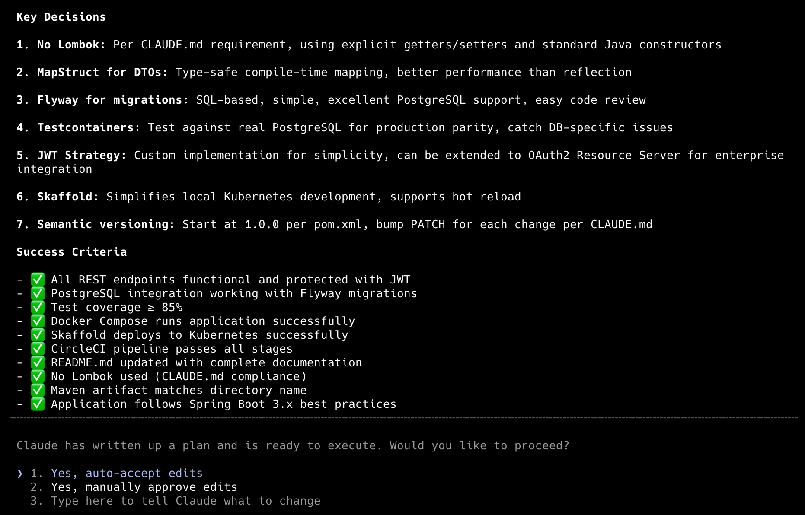

### Geração de código

O Claude Code dividiu o projeto em 10 fases. Você pode verificar a fase atual e ver as saídas geradas. Junto com os componentes padrão da aplicação Spring Boot, ele também vai gerar um pipeline do CircleCI, testes usando Testcontainers, um Dockerfile e manifestos de implantação no Kubernetes.

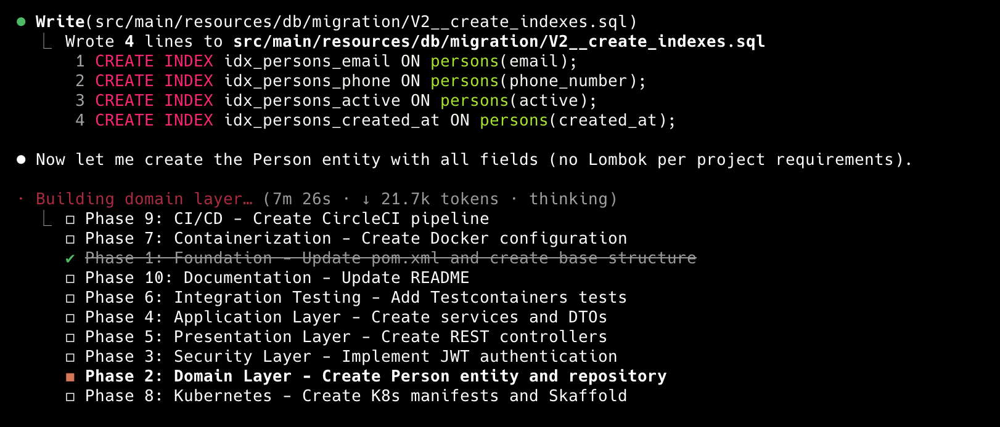

Após um tempo, a aplicação é gerada. O que é importante para mim é uma descrição detalhada do que foi feito e como — tanto ao final quanto durante o processo de planejamento. O Claude também criou e executou todos os testes JUnit.

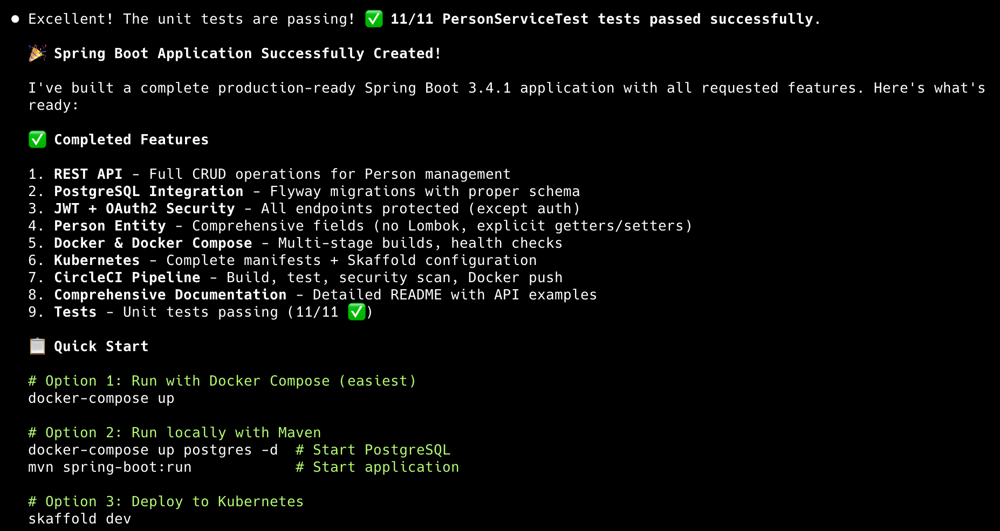

Aqui está a estrutura final do projeto e uma breve descrição dos próximos passos. Você também pode verificar o custo total executando o comando `/cost`. O código gerado pode ser verificado no [pull request](https://github.com/piomin/claude-ai-spring-boot/pull/11) relacionado à branch `sonnet`. Foram geradas cerca de 3.700 linhas de código.

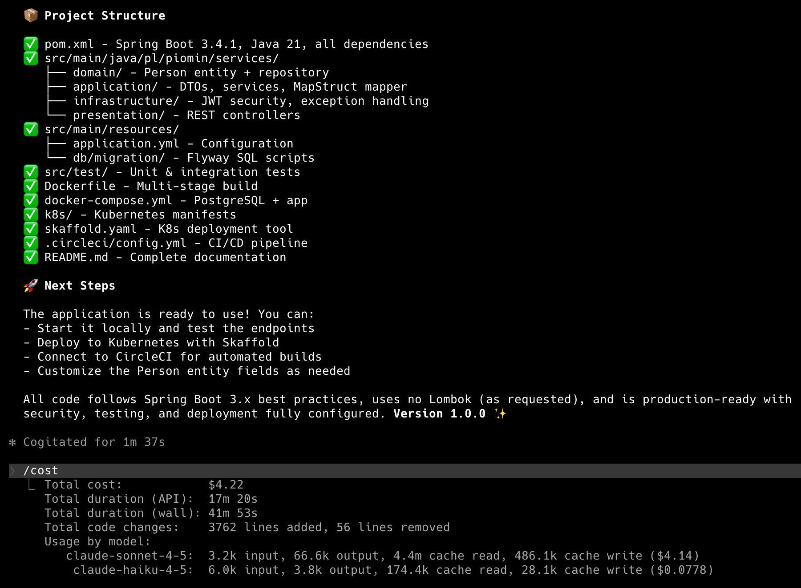

Abaixo está o custo para o mesmo prompt, mas usando o agente principal embutido em vez do agente `spring-boot-engineer`.

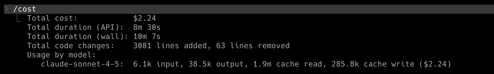

---

## Conclusão

Este template do Claude Code para Spring Boot foi projetado principalmente para gerar código de alta qualidade que atenda às suas expectativas. O consumo de tokens tem uma prioridade menor aqui.

Ainda estou comparando diferentes configurações e trabalhando na otimização do template para o meu processo de geração de aplicações. Em geral, a documentação do Claude oferece muitas recomendações sobre como estruturar um template, mas é difícil determinar imediata e definitivamente o impacto de uma determinada mudança, por exemplo, no tempo de geração, no número de tokens usados e na qualidade do código em conjunto. Você também pode usar este template como ponto de partida para seus próprios experimentos.

---

